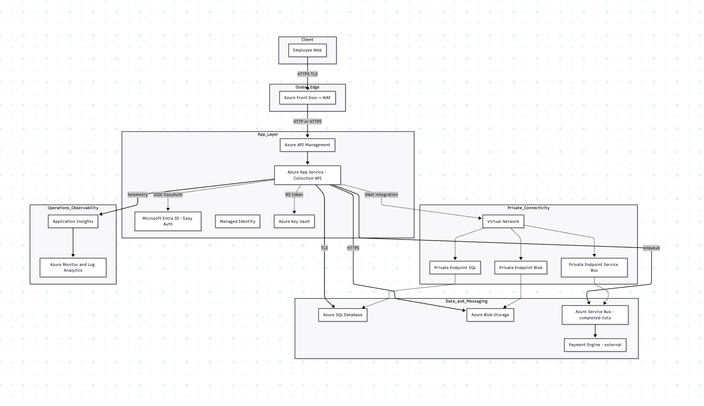

# Spar Collection

School project prototype for managing shopping lists. Built with React (frontend) and Azure Functions⚡️ (Python) backed by PostgreSQL.

**Important:** This is a school project created for educational purposes. It was never intended to be production-ready or secure for real-world use. 

## Project Structure



## Quick Start

### Option 1: Docker (Recommended)

```bash
# Start all services (PostgreSQL, Backend, Frontend)
docker-compose up -d

# View logs
docker-compose logs -f

# Stop all services
docker-compose down
```

Visit http://localhost:5173 and login with your own user once created in the database.

### Option 2: Manual Setup

```bash
# Backend
cd azure_functions
python -m venv .venv && source .venv/bin/activate
pip install -r requirements.txt
func start

# Frontend
cd frontend
npm install
npm run dev
```

Visit http://localhost:5173 and login with your own user once created in the database.

## Authentication

Authentication is handled via Azure Functions with bcrypt password hashing. Users are stored in the PostgreSQL database. Create your own user records in the `spar.users` table before logging in.

## Configuration

### Docker Setup

No configuration needed! Docker Compose sets up everything automatically:
- PostgreSQL database with user `spar_user` / password `spar_password`
- Backend automatically connects to PostgreSQL
- Frontend connects to backend at `http://localhost:7071/api`

### Manual Setup

Create `local.settings.json` in `azure_functions/`:
```json
{
  "IsEncrypted": false,
  "Values": {
    "FUNCTIONS_WORKER_RUNTIME": "python",
    "POSTGRES_HOST": "your-db-host",
    "POSTGRES_DATABASE": "spar",
    "POSTGRES_USER": "your-user",
    "POSTGRES_PASSWORD": "your-password",
    "POSTGRES_PORT": "5432"
  }
}
```

Create `.env` in `frontend/`:
```env
VITE_API_URL=http://localhost:7071/api
VITE_AUTH_KEY=spar_auth_user
```

## API Endpoints

| Method | Endpoint | Description |
|--------|----------|-------------|
| POST | `/api/auth_login` | Authenticate user |
| GET | `/api/lists_get?shopId=<id>` | Get all lists for a shop |
| GET | `/api/list_get?listId=<id>` | Get specific list |
| POST | `/api/list_create?shopId=<id>` | Create new list |
| POST | `/api/item_update/{listId}/{itemId}` | Update item status |
| POST | `/api/list_complete/{listId}` | Mark list as completed |
| DELETE | `/api/list_delete/{listId}` | Delete list |

## Features

- User login with shop assignment
- Create and manage shopping lists
- Mark items as collected or unavailable
- Offline support with automatic sync
- Real-time updates
- Payment processing integration

## Docker Commands

```bash
# Start services
docker-compose up -d

# View logs
docker-compose logs -f backend
docker-compose logs -f frontend
docker-compose logs -f postgres

# Restart a service
docker-compose restart backend

# Stop services
docker-compose down

# Remove all data (including database)
docker-compose down -v

# Rebuild after code changes
docker-compose up -d --build
```

## Notes

- This is a **school project** - not production-ready
- Security and production best practices were not the primary focus
- Authentication uses bcrypt for password hashing
- Payment engine uses database product pricing
- Offline data is cached in browser localStorage
- User sessions stored in localStorage (no JWT/session tokens)
- Docker Compose includes PostgreSQL, backend, and frontend
- Database schema is automatically loaded on first run
